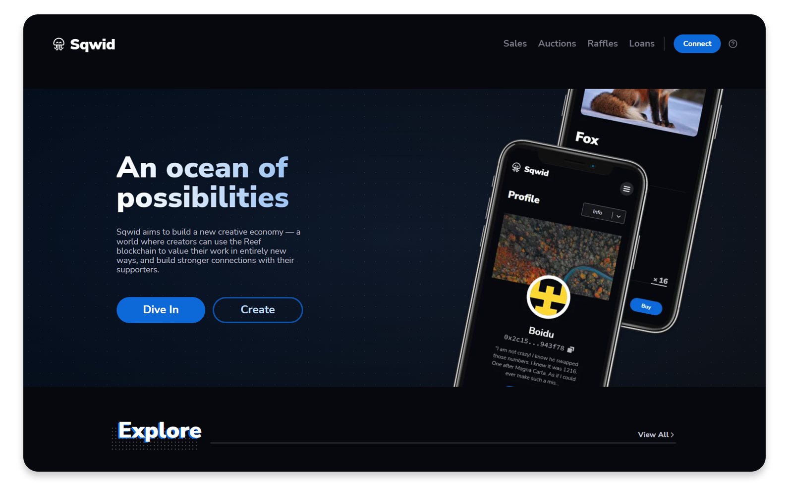

<p align="center">
	
	<h1 align="center">Sqwid - An NFT Marketplace</h1>
</p>
<p align="center">
  
  <a href="https://github.com/sqwid-app/sqwid-client/blob/master/LICENSE" target="_blank">
    
  </a>
</p>

<p align="center">

<h2 align="center"> <a href="https://sqwid.app" target="_blank">Sqwid</a> - An ocean of possibilities</h2> 
</p>

## 👨‍💻 About Sqwid

Sqwid is an NFT marketplace running on the Reef chain that features per-item
customizable royalties.\
\
All Sqwid NFTs are ERC1155 compatible which means each one can have multiple
copies;\
\
They also implement the EIP-2981 Royalty Standard, which allows creators to set
a royalty percent that automatically gets transferred to their wallet whenever
future sales of the NFTs happen. No extra work needed.\
\
Sqwid supports image, video, and audio NFTs and all metadata is stored on
Filecoin and IPFS which means the content you're buying or selling will never be
taken down or tampered with.

## 📺 Presentation

> https://www.youtube.com/watch?v=PHbwC92ylHU

## 🚀 Usage

```sh
git clone https://github.com/sqwid-app/sqwid-client.git
yarn && yarn start
```
or you can do run it using docker

```
docker build -t sqwidapp .     
docker run -p 3000:3000 sqwidapp
```

## 🧔 Authors

👤 **Andrei Cracanau**

-   Github: [@andithemudkip](https://github.com/andithemudkip)
-   LinkedIn: [@andithemudkip](https://www.linkedin.com/in/andithemudkip/)

👤 **Boidushya Bhattacharyay**

-   Website: https://boidushya.com
-   Github: [@boidushya](https://github.com/boidushya)
-   LinkedIn: [@boidushya](https://linkedin.com/in/boidushya)

## 🤝 Contributing

Contributions, issues and feature requests are welcome!<br />Feel free to check
[issues page](https://github.com/sqwid-app/sqwid-client/issues). You can also
take a look at the
[contributing guide](https://github.com/sqwid-app/sqwid-client/blob/master/CONTRIBUTING.md).

## ✨ Show your support

Give us a ⭐️ if you liked this project!

## 📝 License

Copyright © 2021 [Andrei Cracanau](https://github.com/andithemudkip) &
[Boidushya Bhattacharyay](https://github.com/boidushya).<br /> This project is
[MIT](https://github.com/sqwid-app/sqwid-client/blob/master/LICENSE) licensed.

---

Made with 💖 by Team Sqwid
