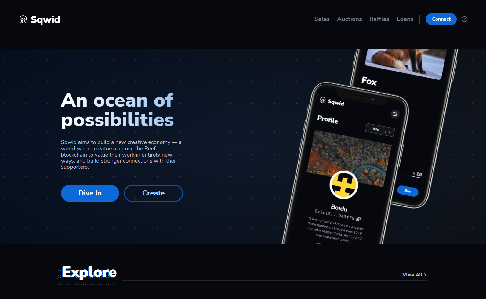

<p align="center">
	
	<h1 align="center">Sqwid - NFT Marketplace</h1>
</p>
<p align="center">
  
  <a href="https://github.com/sqwid-app/sqwid-client/blob/master/LICENSE" target="_blank">
    
  </a>
</p>

<p align="center">

<h2 align="center">Sqwid - An ocean of possibilities</h2> 
</p>

### 🏠 [Homepage](https://sqwid.app)

## ⚙ Install

```sh
git clone https://github.com/sqwid-app/sqwid-client.git
yarn install
```

## 🚀 Usage

```sh
git clone https://github.com/sqwid-app/sqwid-client.git
yarn && yarn start
```


## 🧔 Authors

👤 **Andrei Cracanau**

* Github: [@andithemudkip](https://github.com/andithemudkip)
* LinkedIn: [@andithemudkip](https://www.linkedin.com/in/andithemudkip/)

👤 **Boidushya Bhattacharyay**

* Website: https://boidushya.com
* Github: [@boidushya](https://github.com/boidushya)
* LinkedIn: [@boidushya](https://linkedin.com/in/boidushya)

## 🤝 Contributing

Contributions, issues and feature requests are welcome!<br />Feel free to check [issues page](https://github.com/sqwid-app/sqwid-client/issues). You can also take a look at the [contributing guide](https://github.com/sqwid-app/sqwid-client/blob/master/CONTRIBUTING.md).

## ✨ Show your support

Give a ⭐️ if this project helped you!

## 📝 License

Copyright © 2021 [Andrei Cracanau & Boidushya Bhattacharyay](https://github.com/boidushya).<br />
This project is [GNU GPLv3](https://github.com/sqwid-app/sqwid-client/blob/master/LICENSE) licensed.

***

Made with 💖 by Team Sqwid